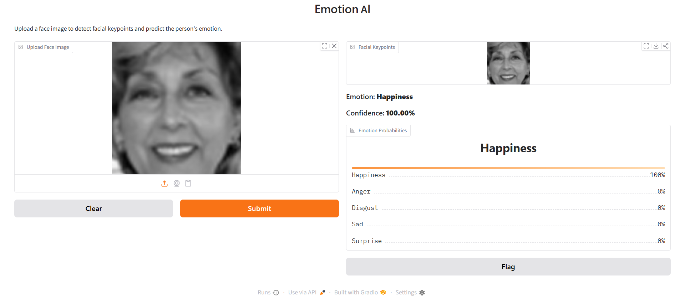

# AI-Powered-Facial-Emotion-Recognition-Emotions-by-AI
An end-to-end Computer Vision and Deep Learning system for **facial analysis**, combining **facial keypoint detection** and **facial emotion recognition** in an interactive AI application.

The system takes a face image as input, identifies important facial keypoints, predicts the person's emotion, and displays the prediction confidence through an interactive user interface.


### Emotion AI Interface



The application provides an interactive interface where users can upload a face image and receive:

* Facial keypoint visualization
* Predicted facial emotion
* Prediction confidence
* Emotion probability distribution
* Interactive inference through a Gradio-based interface

---

## Project Overview

The project consists of two main Deep Learning components:

### 1. Facial Keypoint Detection

A deep learning model designed to detect facial landmarks from grayscale face images.

The model predicts **15 facial keypoints**, represented by their corresponding `(x, y)` coordinates.

The architecture uses residual learning concepts with convolutional blocks, batch normalization, ReLU activation, pooling layers, and shortcut connections.

### 2. Facial Emotion Recognition

A convolutional neural network designed to classify facial expressions into five emotion categories:

* Happiness
* Anger
* Disgust
* Sad
* Surprise

The emotion recognition model uses a **ResNet-inspired architecture** with convolutional layers, batch normalization, residual connections, pooling, dropout, and a softmax classification layer.

---

## Key Features

* Facial Keypoint Detection
* Facial Emotion Recognition
* ResNet-inspired Deep Learning Architecture
* Image Preprocessing and Augmentation
* Model Training and Evaluation
* Emotion Probability Visualization
* Interactive Gradio Interface
* TensorFlow / Keras Model Development
* TensorFlow Serving for Model Deployment
* REST API-based Inference
* Explainable AI using Grad-CAM

---

## System Workflow

```text
Input Face Image
       │
       ▼
Image Preprocessing
       │
       ├──────────────────────┐
       ▼                      ▼
Facial Keypoint Model     Emotion Model
       │                      │
       ▼                      ▼
Facial Keypoints          Emotion Prediction
                              │
                              ▼
                     Probability Distribution
                              │
                              ▼
                    Interactive UI / API
```

---

## Deep Learning Architecture

The project applies residual learning concepts to improve feature extraction and model learning.

### Residual Blocks

The architecture contains two main types of residual structures:

* Convolutional Block
* Identity Block

These blocks use shortcut connections to allow information and gradients to flow through the network more effectively.

The main components include:

* `Conv2D`
* `BatchNormalization`
* `ReLU`
* `MaxPooling2D`
* Residual / Shortcut Connections
* Average Pooling
* Dropout
* Dense Layers
* Softmax Output

---

## Facial Emotion Recognition

The emotion recognition pipeline processes grayscale facial images and prepares them for model inference.

The images are resized to:

```text
96 × 96 × 1
```

The trained model predicts one of five emotion classes and produces a probability distribution across all classes.

Example output:

```text
Emotion: Happiness
Confidence: 100.00%

Happiness    100%
Anger          0%
Disgust        0%
Sad            0%
Surprise       0%
```

---

## Explainable AI

To make the model predictions more interpretable, the project also explores **Grad-CAM (Gradient-weighted Class Activation Mapping)**.

Grad-CAM helps visualize the image regions that contribute most to the model's prediction, providing insight into which facial areas influence the predicted emotion.

This helps move the system beyond simple classification toward more interpretable AI.

---

## Model Deployment

The trained models were prepared for deployment using **TensorFlow Serving**.

The deployment pipeline allows models to be exposed through REST APIs and used for inference outside the training environment.

```text
Client / Application
        │
        ▼
     REST API
        │
        ▼
TensorFlow Serving
        │
        ▼
Trained AI Model
        │
        ▼
Prediction
```

This makes the trained models suitable for integration into external applications and AI-powered services.

---

## Interactive Application

The final system includes a **Gradio-based interface** that allows users to interact with the trained models without directly working with the underlying code.

Users can:

1. Upload a face image.
2. Submit the image for inference.
3. View detected facial information.
4. View the predicted emotion.
5. View the prediction confidence.
6. Inspect the probability distribution of the emotion classes.

---

## Technologies Used

### Programming

* Python

### Deep Learning

* TensorFlow
* Keras
* Convolutional Neural Networks
* Residual Networks
* Transfer Learning Concepts

### Computer Vision

* OpenCV
* Facial Image Processing
* Facial Keypoint Detection

### Explainable AI

* Grad-CAM

### Deployment

* TensorFlow Serving
* REST API

### Interface

* Gradio

### Development

* Jupyter Notebook
* Google Colab

---

## Project Structure

```text
AI-Powered-Facial-Emotion-Recognition/
│
├── assets/
│   └── emotion-ai-ui.png
│
├── Emotions_by_AI.ipynb
├── facial_detection.ipynb
│
├── detection.json
├── emotion.json
├── face_detection.json
│
├── models.config
├── server
│
├── weights.h5
├── weights_emotion.hdf5
├── weights_emotions.hdf5
│
├── facial_detection
└── README.md
```

---

## Getting Started

### Clone the Repository

```bash
git clone https://github.com/YOUR_USERNAME/AI-Powered-Facial-Emotion-Recognition.git
cd AI-Powered-Facial-Emotion-Recognition
```

### Install Dependencies

```bash
pip install tensorflow opencv-python numpy pandas matplotlib gradio
```

Additional dependencies may be required depending on the notebook and deployment configuration.

### Run the Application

Open the main notebook:

```text
Emotions_by_AI.ipynb
```

Run the notebook cells and launch the Gradio interface to interact with the trained models.

---

## Example

Upload a facial image through the interface:

```text
Input Image
     │
     ▼
Facial Analysis
     │
     ├── Facial Keypoints
     │
     └── Emotion Recognition
              │
              ▼
         Happiness
         Confidence: 100%
```

---

## Learning Objectives

This project provided practical experience in:

* Building Deep Learning models for Computer Vision
* Designing residual neural network architectures
* Facial feature and keypoint detection
* Facial emotion classification
* Image preprocessing and augmentation
* Model training and evaluation
* Model serialization and weight management
* Explainable AI
* TensorFlow Serving
* REST API-based inference
* Building interactive AI interfaces with Gradio

---

## Future Improvements

Potential improvements include:

* Real-time webcam-based emotion recognition
* Support for additional emotion categories
* Improved model generalization
* Multi-face emotion detection
* Real-time facial keypoint tracking
* Improved deployment through Docker
* Cloud-based model serving
* Mobile or web application integration

---

## Author

**Amr Ahmed Abdelrehem**

AI Engineer | Machine Learning | Deep Learning | Computer Vision | Generative AI

Cairo, Egypt

---

## License

This project is intended for educational and demonstration purposes.
